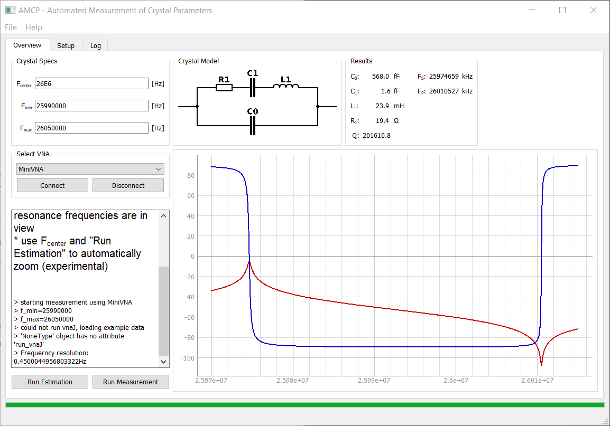

# amcp
**WORK IN PROGRESS!**

ampc is an automated measurement tool of crystal parameters using a vector network analyser. 

## Project Description
This Project is intended to automate the measurement of crystals up to about 150MHz using a cheap VNA such as the miniVNA or nanoVNA. The measurement method requires a passive test-fixture according to IEC-444 which is a douple-pi network terminating the crystal at 12.5Ohm.

## Project Status
### Software
- [X] Basic Functions
- [ ] Advanced Functions
- [X] basic Gui
- [ ] complete Gui

#### Hardware Support
- [X] miniVNA tiny 
- [ ] nanoVNA (planned)

### Hardware
- [ ] Test-Fixture IEC-444
