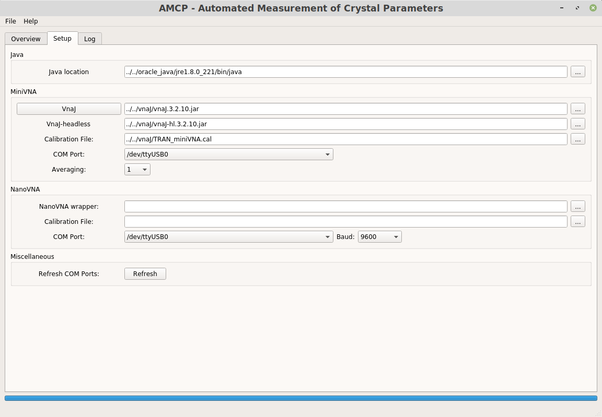

# GUI
The gui is using QT5 (PYQT5) and is designed using QT Designer 5 for simplicity. The QT Designer files (amcp_test.ui) are also included in this folder so it can be modified.

## Todo List
- [X] Basic GUI design
- [X] Basic functionality (miniVNA)
- [ ] Basic functionality (nanoVNA)
- [x] Saving/Loading of setup
- [ ] VNA Calibration from GUI

# Examples

